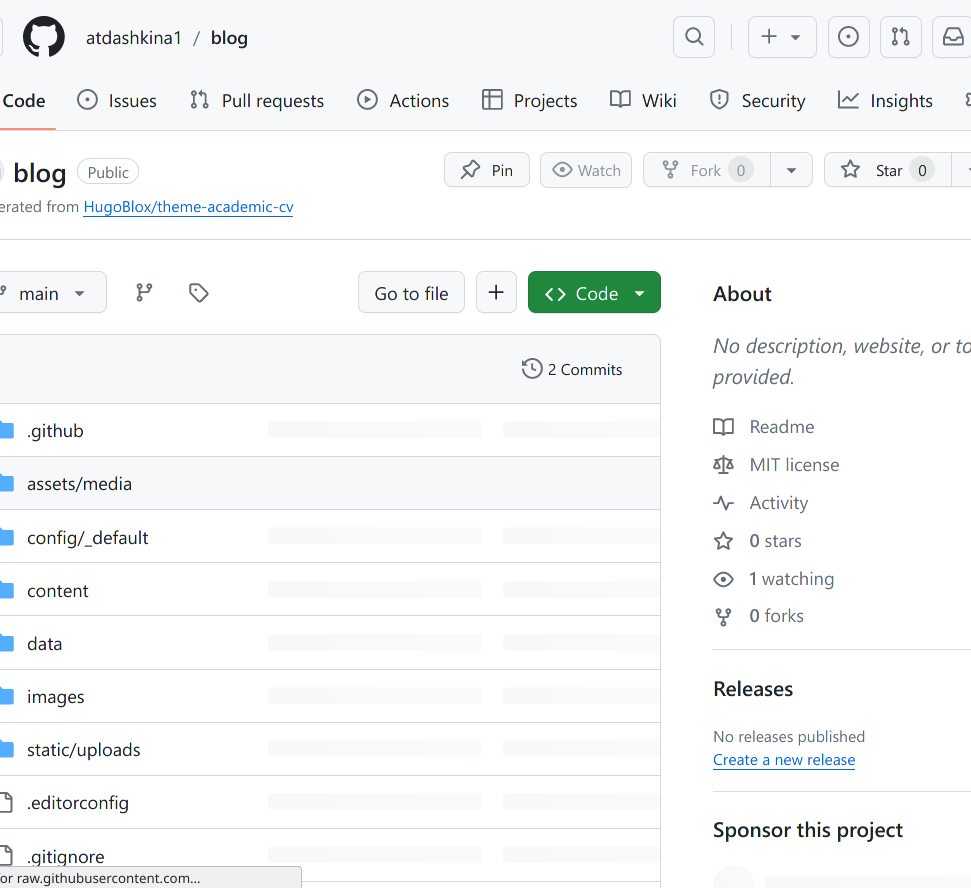
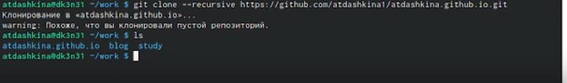
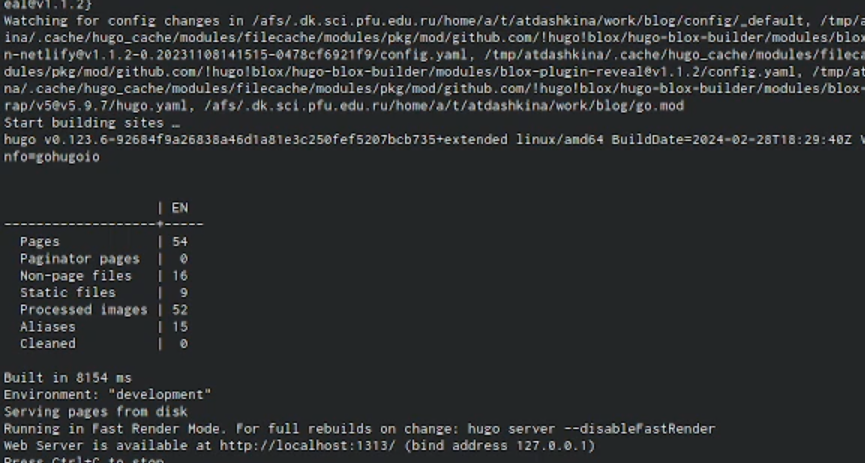
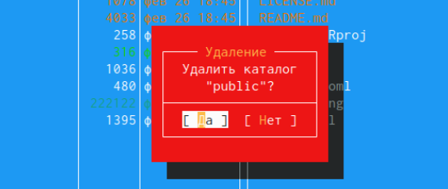
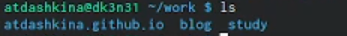
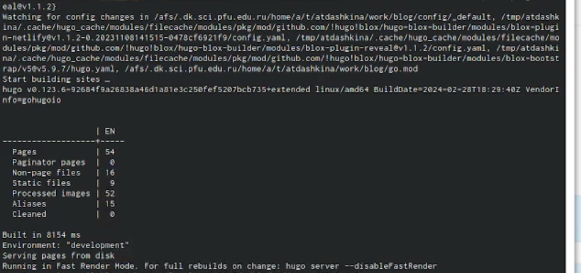
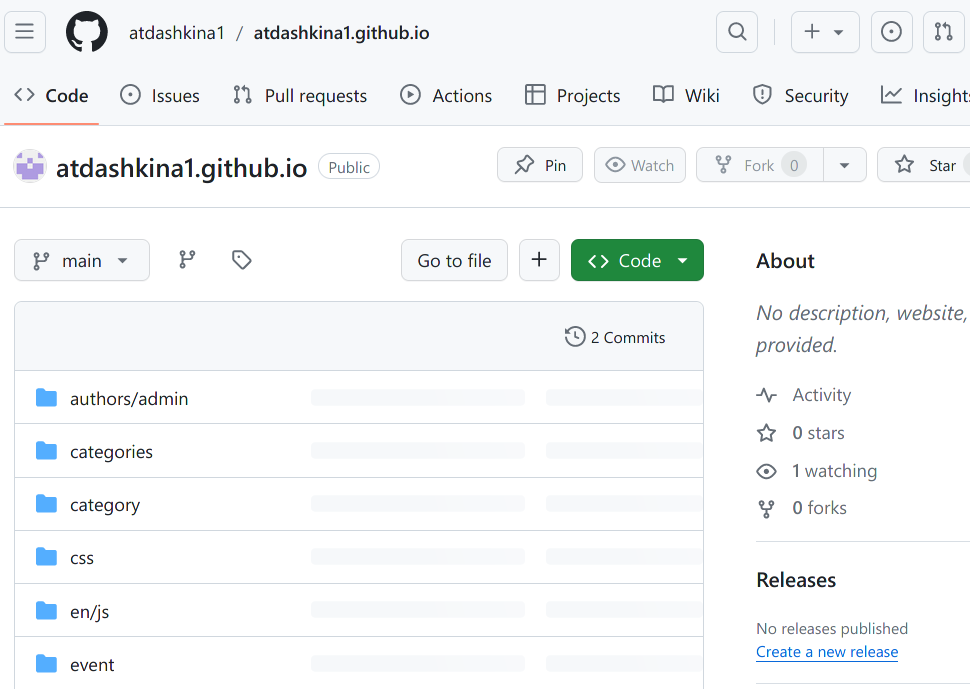
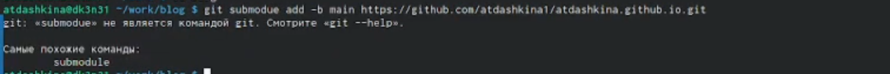

---
## Front matter
title: "Отчет о выполнении индивидуального проекта.Этап 1"
subtitle: 
author: "Дашкина Анита Тагировна"

## Generic otions
lang: ru-RU
toc-title: "Содержание"

## Bibliography
bibliography: bib/cite.bib
csl: pandoc/csl/gost-r-7-0-5-2008-numeric.csl

## Pdf output format
toc: true # Table of contents
toc-depth: 2
lof: true # List of figures
lot: true # List of tables
fontsize: 12pt
linestretch: 1.5
papersize: a4
documentclass: scrreprt
## I18n polyglossia
polyglossia-lang:
  name: russian
  options:
	- spelling=modern
	- babelshorthands=true
polyglossia-otherlangs:
  name: english
## I18n babel
babel-lang: russian
babel-otherlangs: english
## Fonts
mainfont: PT Serif
romanfont: PT Serif
sansfont: PT Sans
monofont: PT Mono
mainfontoptions: Ligatures=TeX
romanfontoptions: Ligatures=TeX
sansfontoptions: Ligatures=TeX,Scale=MatchLowercase
monofontoptions: Scale=MatchLowercase,Scale=0.9
## Biblatex
biblatex: true
biblio-style: "gost-numeric"
biblatexoptions:
  - parentracker=true
  - backend=biber
  - hyperref=auto
  - language=auto
  - autolang=other*
  - citestyle=gost-numeric
## Pandoc-crossref LaTeX customization
figureTitle: "Рис."
tableTitle: "Таблица"
listingTitle: "Листинг"
lofTitle: "Список иллюстраций"
lotTitle: "Список таблиц"
lolTitle: "Листинги"
## Misc options
indent: true
header-includes:
  - \usepackage{indentfirst}
  - \usepackage{float} # keep figures where there are in the text
  - \floatplacement{figure}{H} # keep figures where there are in the text
---

# Цель работы

Размещение на Github pages заготовки для персонального сайта.

# Задание

  Установить необходимое программное обеспечение.
    Скачать шаблон темы сайта.
    Разместить его на хостинге git.
    Установить параметр для URLs сайта.
    Разместить заготовку сайта на Github pages.

# Теоретическое введение

# Выполнение индивидуального проекта

Скачиваем hugo exstending.Создаем папку bin и вставляем файл hugo.

{#fig:001 width=70%}

Создаем репозиторий blog 

{#fig:002 width=70%}

Клонируем репозиторий blog 

{#fig:003 width=70%}

Перейдем в blog и выполним команду ~/bin/hugo server.Проверяем папку 

{#fig:004 width=70%}

Удаляем папку public

{#fig:005 width=70%}

{#fig:006 width=70%}

Выполним команду ~/bin/hugo server переходим по ссылке localhost и уберем шапку сайта.Перейдем для этого в папку content и отредактируем файл index.md

{#fig:007 width=70%}

Создаем новый репозиторий 

{#fig:008 width=70%}

Клонируем репозиторий mkarapaaa.github.io

{#fig:009 width=70%}

Подключим ветку main

{#fig:010 width=70%}

Создадим пустой файл REDME.md 

{#fig:011 width=70%}

Перейдем в файл .gitignore и отредактируем

{#fig:012 width=70%}

Введем команду submodule

{#fig:013 width=70%}

Наполним папку public, используя команду ~/bin/hugo 

{#fig:014 width=70%}

Перейдем в папку public,проверим,отправим все на github.

{#fig:015 width=70%}

Проверим наш сайт

{#fig:016 width=70%}

# Выводы

Размещение на Github pages заготовки для персонального сайта.

